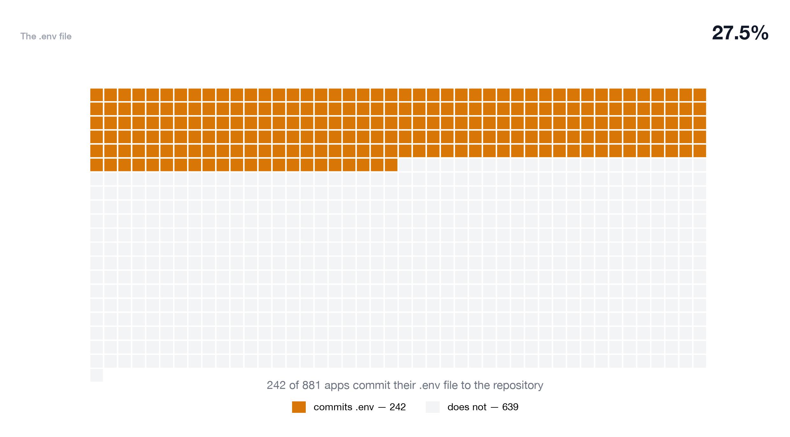
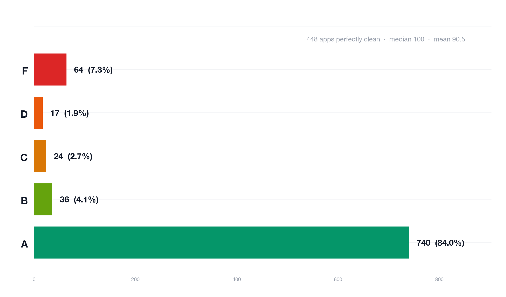
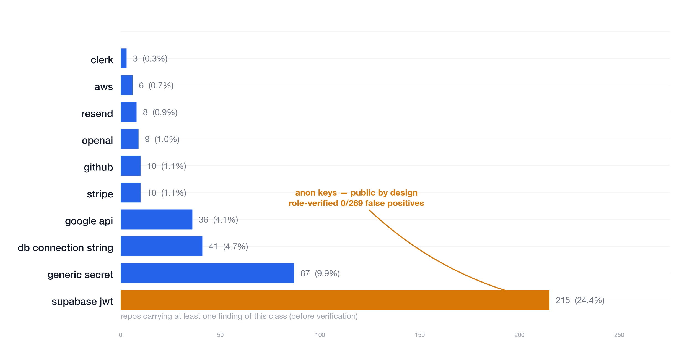
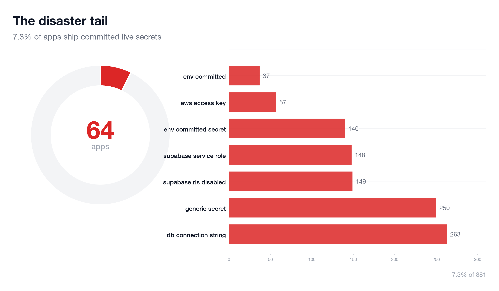
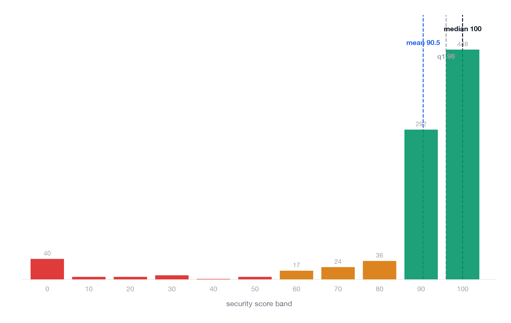
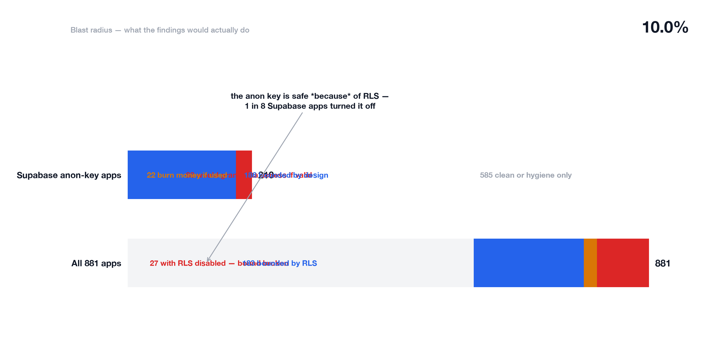
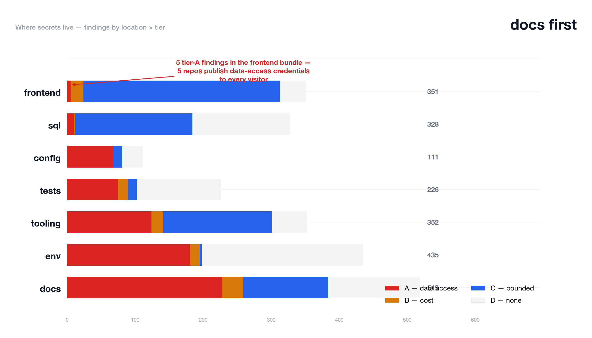
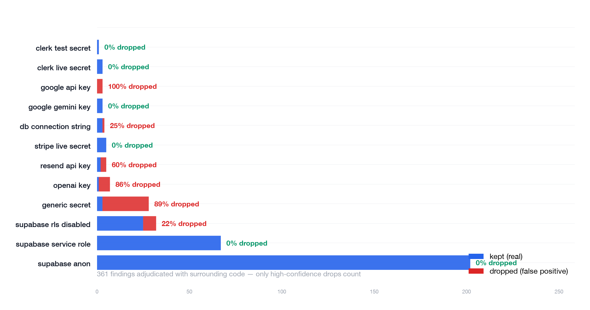

# Corpus Study — 1 in 4 AI-built apps ships its .env file

The Lovable population (N = 881): where the committed-`.env` problem
lives — 27.5% of Lovable-generated repos commit their `.env` file, versus
7.0% (v0) and 1.5% (self-described AI-coded).

**Visual report:** [../report/index.html](../report/index.html) —
charts with the narrative arc. This document is the full technical
write-up; the numbers are identical.

**Second population:** the [v0.dev study](CORPUS_STUDY_V0.md) (N=513,
exhaustive verification) — same engine, different leak mechanics.

**General baseline:** the [AI-coded study](CORPUS_STUDY_AICODED.md)
(N=591, + an app-shaped slice of N=91) — repositories describing
themselves as AI-coded. The exposure is generator-specific, not
AI-specific: 92.9% clean / 1.5% commit .env unfiltered; 71.4% clean /
7.7% commit .env once filtered to app-shaped repos.


**Status: full run — N = 881 repos** (the complete frame: 900 public repos
sampled, 19 excluded for exceeding the 150 MB archive cap). Pilot (N = 40)
established the methodology and produced the engine fixes below; this is
the final dataset.

Inspired by and compared against ogbuilds' "What 1,969 Lovable apps actually
ship" study (https://ogbuilds.ai/studies/lovable-app-security), which we cite
for the corpus signal, the adversarial-verification method, and the
presence-vs-blast-radius framing.

## Method

- **Signal:** GitHub code search `lovable-tagger filename:package.json`
  (Lovable writes the `lovable-tagger` vite plugin into every generated
  project's package.json). **Frame:** top best-match results plus a
  size-bucketed second pass; 900 unique public repos (Aug 12, 2026).
  GitHub's code search caps at 1,000 results per query, so the frame is the
  complete enumerable surface, not a subsample of it.
- **Sample:** the full frame, fixed-seed ordering (`20260812`) — reproducible.
- **Scan:** Septr's rules engine over each repo's GitHub tarball (150 MB cap,
  `node_modules`/`dist`/`.git` excluded), offline. Three rule families:
  - **Existence checks** (durable by construction — a file is either in the
    archive or not): committed `.env`, missing root `.gitignore`, giant text
    file > 1 MB, `curl | sh`.
  - **Bundle checks** (the deployed-bundle rules, run per text file): Supabase
    role-aware JWTs, Stripe/Clerk/OpenAI/Anthropic/AWS/GitHub/Google/Gemini/
    Resend/Cloudinary keys, DB connection strings, private keys, generic
    secrets, RLS-disabled SQL, hardcoded IDs.
  - **Duplication check**: identical text files copied into many places
    (content-hash families, ≥ 3 copies). Emitted as **one low finding per
    repo** (aggregate): a repo that vendors several version snapshots of
    itself hits hundreds of families, which is one pathology, not hundreds
    of findings.
- **Verification:** a seeded 50-repo subsample (361 findings) was adjudicated
  one finding at a time with the surrounding code (redacted), using the same
  model that builds Septr, under the ogbuilds rule: **only high-confidence
  drops count**. Verdicts are published raw (verdicts.jsonl); nothing is
  dropped unless certain.
- **Ethics:** aggregates and anonymized rows only. No repo-to-credential
  mapping is published. No confirmed-live credential testing (that would mean
  using someone's key against their account).

## Headline numbers (N = 881)

| Figure | Septr | ogbuilds (n=1,969) | Notes |
|---|---|---|---|
| Committed `.env` | 27.5% (CI 24.6–30.5) | 23.2% | Durable figure; presence, not exploitability |
| No root `.gitignore` | 10.4% (CI 8.6–12.6) | (reported) | Existence check, never overturned |
| `curl \| sh` pattern | 3.6% (CI 2.6–5.1) | (reported) | Existence check |
| Duplicated file family (≥3 copies) | 8.9% (CI 7.2–10.9) | (reported) | One low finding per repo |
| lovable-tagger confirmed | 98.6% (CI 97.6–99.2) | — | Validates the frame signal |
| Fully clean (no findings) | 50.9% (CI 47.6–54.1) | 2.6% | We exclude template artifacts and don't score existence checks; see honest-reading note below |
| Median security score | 100 | 94 | Same "usually safe" direction |
| **Mean security score** | **90.5** (q1 96 / q3 100) | — | Distribution is the honest summary |

The committed-`.env` rate (27.5%) sits above ogbuilds' 23.2% but within CI
overlap at this sample size. The 98.6% platform-confirmed rate (12 repos
unconfirmed — stripped forks/variants) validates the `lovable-tagger` signal
on the full frame.



## Grades: mostly safe, a small disaster tail

- **A: 740 (84.0%, CI 81.4–86.3)** — 448 perfectly clean + 292 carrying only low findings
  (role-verified anon keys, benign committed env, one duplicated file
  family). ogbuilds' A rate is 64%.
- **B: 36 (4.1%, CI 3.0–5.6), C: 24 (2.7%, CI 1.8–4.0), D: 17 (1.9%, CI 1.2–3.1)** — small middle band.
- **F: 64 (7.3%, CI 5.7–9.2)** — committed live secrets (DB connection strings,
  service-role JWTs, hardcoded keys), mostly the same repos that commit
  `.env` and trip several credential classes at once.

Mean 90.5, quartiles q1 96 / q3 100. The A-band share is *higher* than
ogbuilds' 64% for two reasons, both deliberate: we role-verify anon keys
(theirs land in their hardcoded-jwt rule at higher severity before
verification) and our rule set is narrower (no debug-logging or
cross-file-duplication-heavy deductions per file). "Mostly safe, a few
disasters" is our finding *and* theirs ("the apps are broadly safe and
considerably messier") — the difference is degree, not direction.









## Findings by rule (prevalence, rule output before verification)

| Rule | Findings | Repos | % (CI) | Notes |
|---|---|---|---|---|
| `supabase_anon` | 707 | 210 | 23.8% (CI 21.1–26.8) | Role-verified, low severity — 0/202 FPs |
| `generic_secret` | 306 | 50 | 5.7% (CI 4.3–7.4) | 25/28 dropped; placeholders/docs/shared keys |
| `db_connection_string` | 268 | 24 | 2.7% (CI 1.8–4.0) | Placeholder suppressant removed docs noise |
| `env_committed` | 237 | 204 | 23.2% (CI 20.5–26.1) | One finding per live-secret line in .env |
| `env_committed_secret` | 188 | 56 | 6.4% (CI 4.9–8.2) | Content-classified secrets in .env files |
| `supabase_rls_disabled` | 160 | 33 | 3.7% (CI 2.7–5.2) | 7/32 dropped (disable-then-re-enable in one migration) |
| `supabase_service_role` | 151 | 18 | 2.0% (CI 1.3–3.2) | Real in edge functions, n8n workflows |
| `duplicate_files` | 78 | 78 | 8.9% (CI 7.2–10.9) | One low finding per repo (aggregate) |
| `aws_access_key` | 58 | 6 | 0.7% (CI 0.3–1.5) | |
| `google_api_key` | 50 | 15 | 1.7% (CI 1.0–2.8) | 3/3 dropped (Firebase client config) |
| `google_gemini_key` | 39 | 17 | 1.9% (CI 1.2–3.1) | Real keys in Gemini integrations |
| `stripe_test_secret` | 26 | 2 | 0.2% (CI 0.1–0.8) | Paystack sk_test_ (shares prefix) |
| `github_token` | 23 | 9 | 1.0% (CI 0.5–1.9) | |
| `openai_key` | 19 | 6 | 0.7% (CI 0.3–1.5) | 6/7 dropped (placeholder keys in docs) |
| `resend_api_key` | 15 | 8 | 0.9% (CI 0.5–1.8) | 3/5 dropped (re_your_ templates) |
| `stripe_live_secret` | 15 | 7 | 0.8% (CI 0.4–1.6) | Real keys in agent manifests |
| `anthropic_key` | 14 | 2 | 0.2% (CI 0.1–0.8) | |
| `clerk_test_secret` | 4 | 3 | 0.3% (CI 0.1–1.0) | |
| `clerk_live_secret` | 3 | 1 | 0.1% (CI 0.0–0.6) | |
| `hardcoded_id_route` | 2 | 1 | 0.1% (CI 0.0–0.6) | |
| `cloudinary_secret` | 1 | 1 | 0.1% (CI 0.0–0.6) | |

2,364 total findings across 881 repos. The top three rules by finding count
(`supabase_anon` 707, `generic_secret` 306, `db_connection_string` 268)
account for 54% (1,281 of 2,364) of all findings — and the verification subsample shows 89% of
`generic_secret` findings are placeholders, while `supabase_anon` findings
are all role-verified public-by-design keys.

## Scoring: severity from content, not presence

The security score penalizes findings, and committed `.env` files get
**content-derived** severity — the file itself is not the finding, the keys
in it are. The env classifier is the **single authority** for env-file
content: the bundle scan skips them entirely, so nothing double-counts and
no secret is skipped because the bundle happened to flag one line.

- committed `.env` → **one finding per live-secret line**, at that line's
  severity (high/critical). A file with three secrets carries three findings
  — secrets the bundle scan would miss (unquoted values, `JWT_SECRET_KEY =
  "…"` shapes, lowercase tokens, `.env.template` files the text-file filter
  skips) are all counted.
- committed `.env` with only public-by-design/placeholder/config values →
  one `env_committed` at **low** (−2): a hygiene signal, not an active
  exposure.
- env-file secrets count in the same credential-class table as bundle
  findings (the classifier label maps to the class).

Other existence checks (gitignore, giant file, `curl|sh`) stay
measured-but-unscored: hygiene signals, not findings. The duplication check
is scored (low, −2, one per repo) because repeated copies of the same file
across a repo is the mess the ogbuilds study calls out; the aggregate form
keeps a version-snapshot repo from being punished hundreds of times.

## Credential classes (% of repos, rule output before verification)

| Class | Septr % | Adjusted ~% | ogbuilds % |
|---|---|---|---|
| Supabase JWT (role-verified) | 24.4 | 24 (269 verif, 0 dropped) | 24.8 (hardcoded jwt, unverified) |
| Generic secret (incl. secret-shaped env values) | 9.9 | 1 (25/28 dropped) | 2.0 |
| DB connection string (incl. committed-env creds) | 4.7 | 3 (1/4 dropped) | 7.2 |
| Google API key (incl. Gemini) | 4.1 | 2 (3/6 dropped) | 5.3 |
| Stripe key | 1.1 | 1 (0/6 dropped) | — |
| GitHub token | 1.1 | — | — |
| OpenAI key | 1.0 | 0 (6/7 dropped) | — |
| Resend key | 0.9 | 0 (3/5 dropped) | — |
| AWS key | 0.7 | — | — |
| Clerk key | 0.3 | 0 (0/4 dropped) | — |
| Anthropic / Cloudinary / URL-cred / hardcoded JWT | ≤0.2 each | — | — |

Adjusted = class prevalence × (1 − class drop rate) from the verification
subsample. Our Supabase JWT share is dominated by **anon keys** (public by
design, low severity, role-verified from the JWT payload) — the class the
ogbuilds study says is the ambiguous one; **0/269 Supabase JWT verdicts were
false positives**. The generic-secret share looks large pre-verification but
89% of its findings are placeholders/docs examples/shared community keys
(25/28 dropped); the residual real ones (e.g. a Facebook client_secret in a
SQL migration, a hardcoded `ENCRYPTION_KEY`) are genuine. DB connection
strings sit at 3% adjusted, below ogbuilds' 7.2% — the placeholder/doc
suppressant (see Engine fixes) removed the docs-example noise.

## Blast radius: what the findings would actually do

Prevalence counts findings; this flips the axis to **consequence**. Every
finding maps to one of four tiers — what the credential would grant *if
valid* (no confirmed-live testing; where the format allows, validity is
verified structurally: Supabase roles from the JWT payload itself,
Stripe/Clerk from the live/test prefix):

| Tier | Meaning | Repos | % (CI) |
|---|---|---|---|
| **A — data access** | data read/write/exfil if valid | 88 | 10.0% (CI 8.2–12.1) |
| **B — cost** | burns money if used (AI API keys) | 22 | 2.5% (CI 1.7–3.8) |
| **C — bounded** | safe by design unless misconfigured | 186 | 21.1% (CI 18.5–23.9) |
| **D — none** | clean, or hygiene only (dup families, benign env) | 585 | 66.4% (CI 63.2–69.4) |



**The structural subset is 64 repos (7.3%)** — role-verified service-role
JWTs, live-prefix Stripe/Clerk keys, credential-bearing DB connection
strings, AWS keys, GitHub tokens, and critical `.env` lines (database
URLs with credentials, `service_role` keys). The other 24 tier-A repos
carry secret-shaped symmetric keys (JWT_SECRET, ENCRYPTION_KEY) in
committed `.env` files — flagged by the env classifier's shape detection,
so their validity is inferred rather than verified.

**The Supabase bound.** The anon key is safe *because* of RLS — and
**27 of 210 anon-key apps (12.9%) disabled it** (anon key + RLS off =
data access). 18 repos ship `service_role` (8.6% of Supabase apps),
which bypasses RLS entirely; that count is role-verified from the JWT
payload with 0/269 false positives.

**Committed `.env` lines:** 174 lines in 51 repos sit at tier A — most
are secret-shaped symmetric keys (132 lines), 31 are database connection
strings with credentials, 8 are service-role keys, and one each a Stripe
live key, a GitHub token, and a URL with embedded credentials. Only 23%
of `.env` committers have a live secret at all; the tier-A share of
`.env` committers is 21% (51/242).

The verification subsample holds these tiers at scale: `supabase_service_role`,
`stripe_live_secret`, `clerk_live_secret`, and `google_gemini_key` were
dropped 0 times.

## Where secrets live (file-location mechanics)

Every finding's file path is classified into a location: frontend bundle,
server/tooling code, SQL migrations, config (incl. n8n workflows), docs,
tests, fixtures (emulation artifacts), or committed `.env`. Cross-tabbed
with blast radius:



| Location | A — data | B — cost | C — bounded | D — none | Total |
|---|---|---|---|---|---|
| docs | 228 | 31 | 125 | 135 | 519 |
| committed `.env` | 181 | 14 | 3 | 237 | 435 |
| tooling (server/scripts) | 124 | 17 | 160 | 51 | 352 |
| tests | 75 | 15 | 13 | 123 | 226 |
| config (incl. n8n) | 68 | 0 | 13 | 30 | 111 |
| SQL migrations | 10 | 1 | 173 | 144 | 328 |
| frontend bundle | 5 | 19 | 289 | 38 | 351 |

**Docs are the #1 home of data-access credentials** — 228 of 692 tier-A
findings (33%), written down with instructions: Neon connection analyses,
deployment checklists, setup guides, agent manifests. The verification
subsample is consistent: the docs-heavy classes (`generic_secret` 25/28,
`openai_key` 6/7, `google_api_key` 3/3) were the most-often dropped — docs
findings carry the most placeholder noise at rule-output level, and the
structural 64-repo tier-A subset is the conservative read.

**The frontend bundle is almost clean of data-access keys** — 5 findings in
5 repos (0.6%): 3 service-role JWTs, a DB connection string, a Stripe live
key, all of which would be published to every visitor of the deployed app.
Frontend bundles carry mostly bounded keys (289 anon-key findings — the
`client.ts` integration).

**The committed `.env` carries what docs claim.** 181 tier-A findings
are located in committed env files: the env classifier's 174 tier-A
lines (132 secret-shaped symmetric keys, 31 database connection strings,
8 service-role keys, one each Stripe live / GitHub token / credentialed
URL) plus 7 bundle-rule findings that happen to sit in `.env` files
(6 DB connection strings, 1 live Stripe key).

**Config is where automation secrets live**: 68 tier-A findings in config
— dominated by n8n workflow JSONs with embedded service-role JWTs (the
Hive property-management suite) and `.cursor`/agent manifests with live
Stripe keys.

## Verification subsample (overturn by rule, 361 findings)

| Rule | Dropped | Total | Notes |
|---|---|---|---|
| `supabase_anon` | 0 | 202 | Role-verified from JWT payload — 0 false positives |
| `supabase_service_role` | 0 | 67 | Role-verified; real in edge functions, n8n workflows, configs |
| `generic_secret` | 25 | 28 | 89%: docs placeholders, test fixtures, shared "open for everyone" community keys |
| `supabase_rls_disabled` | 7 | 32 | All 7: migrations that disable then re-enable RLS in one file |
| `openai_key` | 6 | 7 | Short placeholder keys in setup docs |
| `resend_api_key` | 3 | 5 | Placeholder (`re_your_…`) templates |
| `google_api_key` | 3 | 3 | All Firebase client config — public by design |
| `db_connection_string` | 1 | 4 | One `[YOUR-PASSWORD]` docs template; the 3 keeps are hardcoded fallbacks in code |
| `google_gemini_key` | 0 | 3 | Real keys in Gemini integrations |
| `stripe_live_secret` | 0 | 5 | Real keys in agent manifests, test scripts, docs |
| `clerk_test/live_secret` | 0 | 4 | Real Clerk keys in docs + `configure-secrets.sh` |
| `stripe_test_secret` | 0 | 1 | Paystack secret (shares `sk_test_` prefix) — real credential |

**Overall: 45/361 dropped (12.5%)** — vs ogbuilds' 19.8%. Ours lost ~89%
of generic-secret findings but **0% on role-verified JWTs and 0% on
Stripe/Clerk/Gemini real-format keys**, which is the verification design
paying off. Env-class findings (`env_committed*`) are content-classified
existence checks and are excluded from the LLM verification sample, like the
other existence checks.



## Engine fixes applied after the pilot

The N=40 pilot adjudication (20/56 dropped, 35.7%) surfaced engine gaps,
all implemented in `backend/scanner/checks.py` and validated by re-scanning
the pilot archives — every drop shape became a rule-level suppression or
reclassification, and the fixes carry over to the full run (db connection
string: 1/4 drops; Clerk reclassified to its own class; Firebase configs
suppressed; a real hardcoded Resend key now detected):

1. **`db_connection_string` placeholder/doc suppressant.** Placeholder
   hosts (`localhost`, compose service names), placeholder passwords,
   `${...}` interpolation, Neon `ep-example-` hosts, and
   documentation-prose windows are suppressed; real Neon creds in docs
   still fire.
2. **`sk_test_`/`sk_live_` Clerk collision.** New `clerk_test_secret`
   (medium) / `clerk_live_secret` (critical) checks with a Clerk-context
   requirement; Stripe rules exclude Clerk context. Reclassified, not
   dropped.
3. **Gemini keys get their own class** (`google_gemini_key`, high) with an
   AI-Studio fix prompt; Firebase client configs (`firebaseConfig`
   objects, `google-services.json` blobs) are suppressed on both
   `google_api_key` and `generic_secret` — public by design.
4. **Missed detections closed:** `resend_api_key` (`re_…`), `cloudinary_secret`
   (`cloudinary://KEY:SECRET@`), and the `generic_secret` key-name set now
   covers `JWT_SECRET_KEY = "…"`, `ENCRYPTION_KEY = "…"`, `SECRET_KEY = "…"`
   and similar assignment shapes.
5. **The role-verified JWT check remains the model to copy elsewhere:**
   verifying from the value's own format (payload role) instead of
   pattern-matching yields 0/269 false positives at scale.
6. **Post-run hardening:** the Firebase suppressor now also matches the
   env-var-listing shape (`FIREBASE_AUTH_DOMAIN` + `FIREBASE_PROJECT_ID` +
   `FIREBASE_API_KEY`, with or without the `FIREBASE_` prefix) — two
   docs-style findings in the full run were dropped by adjudication that
   the rule itself would now suppress. No numbers change; the verdicts
   already excluded them.

## Raw data (this directory)

- `frame.json` — the 900-repo frame (queries, timestamps)
- `archives/` — 881 downloaded tarballs (gitignored)
- `scan-results.jsonl` — per-repo rows (existence flags + findings, redacted previews)
- `verify-task.jsonl` — the 361 adjudication tasks with redacted context
- `verdicts.jsonl` — verdicts, confidence, reasons
- `aggregates.json` — machine-readable results
- `scan-results.anonymized.jsonl`, `verdicts.anonymized.jsonl` — published rows (repo ids → sequential ids)

## How to reproduce

```bash
# 1. Frame (already built; rebuild anytime)
GITHUB_TOKEN=... python backend/scripts/corpus/build_frame.py

# 2. Download the full frame (resumable; ~8 GB, ~10-20 min)
python backend/scripts/corpus/download_corpus.py --count 1000 --seed 20260812 --workers 8

# 3. Scan (resumable)
python backend/scripts/corpus/scan_corpus.py --workers 4

# 4. Emit verification tasks (50 repos)
python backend/scripts/corpus/verify_corpus.py --repos 50 --seed 20260812

# 5. Adjudicate verify-task.jsonl → verdicts.jsonl (in-window, or any LLM)
# 6. Aggregate
python backend/scripts/corpus/aggregate_corpus.py

# 7. Publish rows (ids → app-XXX, repo-root stripped from paths)
python backend/scripts/corpus/anonymize_corpus.py
```

## Known limitations

- Frame is GitHub code-search best-match, not a uniform sample of all Lovable
  apps; forks and template copies are not excluded (same as ogbuilds).
  GitHub's 1,000-results-per-query cap means the 900-repo frame is the
  enumerable surface, which may over-represent larger/more recent repos.
- Existence checks are only measured, not scored, in the security grade —
  "clean" here means "no findings of any scored rule".
- Verification is single-model, high-confidence-drops-only; the study states
  this rather than hiding it. 19 of 900 sampled repos were excluded for
  exceeding the 150 MB archive cap.

## Honest reading

Scores and the "fully clean" rate are **lower bounds**. Existence checks
(gitignore, giant file, `curl|sh`) are measured but not scored, and
low-severity public-by-design findings (anon keys, benign committed env)
count against the score even though they are not active exposures. The
true "no real security issues" rate is closer to the A-band share
(**84.0%**) than to the clean rate (50.9%).

The ogbuilds study makes the same point in reverse: their 2.6% clean rate
is a lower bound because their engine includes code-quality rules
(deep nesting, debug logging, in-file repetition, large files) with high
false-positive rates, and their own analysis says "more than 2.6% are
genuinely clean — the direction is certain; the size is not measured."
Both studies point the same way: these apps are safer than the raw
numbers suggest, and the honest summary is the distribution (q1 96,
median 100, mean 90.5), not any single headline.
