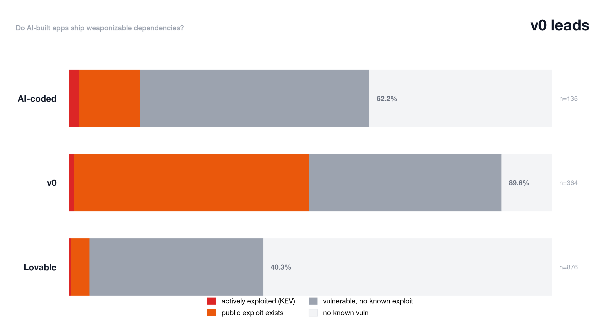

# Corpus Study — Do AI-built apps ship weaponizable dependencies?

**Status: full run — all three populations, 1,375 repos with pinned
dependency manifests.** Every pinned dependency in every archive was
queried against OSV (9,966 unique deps), and every matching
vulnerability was enriched with exploitability: **KEV** (CISA Known
Exploited Vulnerabilities — actively exploited in the wild) and
**public exploit** (Exploit-DB, CVE-mapped, webapp-relevant).

The companion axis to the secrets studies: secrets are what *you* ship
by accident; vulnerable dependencies are what everyone ships by default
— and the difference in weaponizability is the point.

## The headline

| Population | Repos w/ manifests | ≥1 vulnerable dep | ≥1 actively exploited (KEV) | ≥1 with public exploit |
|---|---|---|---|---|
| Lovable | 876 | **40.3%** | 0.5% | 4.1% |
| v0 | 364 | **89.6%** | 1.1% | **49.5%** |
| AI-coded (repos w/ manifests) | 135 | 62.2% | 2.2% | 14.1% |

(The AI-coded row covers the full 591-repo frame's repos that pin a
manifest — 135 — not the stricter app-shaped slice of 91.)



**v0 is the dependency story.** Nine out of ten v0 apps with a manifest
ship at least one known-vulnerable dependency, and **half of them ship
one with a public exploit** — a weaponizable dependency. Lovable is
dramatically better on dependencies than it is on secrets (40.3% vs
27.5% committed .env), and the AI-coded baseline sits between.

## Why v0 is so much worse

The top vulnerable packages tell the story:

| v0 | Lovable |
|---|---|
| mongoose@8.0.3 (152 repos) | express@4.18.2 (53) |
| express@4.18.2 (130) | xlsx@0.18.5 (45) |
| next@14.0.4 (91) | uuid@11.1.0 (39) |
| axios@1.6.2 (80) | axios@1.10.0 (25) |

v0 templates pin **older major versions** (next@14, mongoose@8,
axios@1.6) that accumulate vulnerabilities as the ecosystem moves on —
and v0 apps ship the template deps largely untouched. Lovable apps pin
newer versions (axios@1.10, uuid@11) because the generator's template
refreshes faster; their dependency debt is lower but their secrets debt
is higher. The two generators' risk profiles are inverted: **Lovable
leaks secrets, v0 ships weaponizable dependencies.**

## The KEV subset (the true emergencies)

11 repos across all populations carry a dependency on CISA's actively
exploited list — including vite@5.0.0 (CVE-2025-32395), jquery@3.3.1
(CVE-2019-11358), litellm@1.80.0, and Pillow@10.0.0. These are the
grade-changers: known, actively exploited, and in the repo. The severity
policy reflects this — KEV findings escalate to critical; public-exploit
findings are flagged in the finding text but don't change the grade
(the PoC may target a different version range than the repo's).

## Method

- **Scope:** pinned production dependencies only (package.json +
  requirements.txt; devDependencies excluded; `node_modules`/`pkg/mod`
  vendored trees skipped — same pruning as the secrets studies).
- **Detection:** OSV (Google's open-source vulnerability database),
  queried per unique dep; full records fetched per vulnerability ID
  (the batch endpoint's minimal records carry no aliases/severity —
  a bug fixed as part of this study, see below).
- **Exploitability:** CISA KEV catalog (actively exploited in the wild)
  + Exploit-DB CVE mapping (public exploit code exists; webapp +
  verified entries flagged). Index built from the public sources,
  snapshot date in `exploit-index.json`.
- **Limits:** pinned versions only (unpinned ranges are skipped);
  OSV coverage is ecosystem-dependent; version matching is
  server-side/API-exact for detection and the exploit-PoC-to-version
  match is not verified — which is exactly why Exploit-DB flags are
  informational and KEV is not.

## Engine fix surfaced by this study

The OSV **batch** endpoint returns minimal records (`{id, modified}`) —
no CVE aliases, no CVSS severity, no affected ranges. `osv.py` was
consuming those, which silently degraded every dependency finding: all
"low" severity, no fixed versions, no CVE ids. `_query_batch` now
discovers ids via batch and fetches **full records per id**
(cached, threaded), restoring correct severity, fix prompts, and the
exploitability enrichment. The product's URL-scan dependency findings
are correct again.

## Why exploitability is the right lens

Microsoft reports its vulnerability volume is **up 9× since March 2026**,
with AI-driven discovery harnesses turning static-analysis results into
working exploits in ~21 minutes each (Wesson, Black Hat 2026 keynote).
Raw vulnerability counts are a rising tide every dependency scanner will
report; **KEV (actively exploited) and public-exploit existence are the
signals that separate weaponizable from theoretical** — which is the
argument for reading this snapshot through that lens, and re-running it
as the ecosystem changes.


## Raw data (this directory)

- `deps-results.jsonl` — per-repo rows (population, deps, vuln_deps with severity/KEV/exploit flags)
- `deps-aggregates.json` — per-population counts + exclusive chart segments + top vulnerable packages
- `exploit-index.json` (in `../data/corpus/`) — the CVE → {kev, public_exploit, webapps, verified, edb_ids} index

## Reproduce

```bash
python backend/scripts/corpus/refresh_exploit_index.py   # rebuild the CVE index
python backend/scripts/corpus/deps_study.py              # re-run the corpus query
python backend/scripts/corpus/generate_report.py \
    --deps backend/data/corpus-deps/deps-aggregates.json
```
