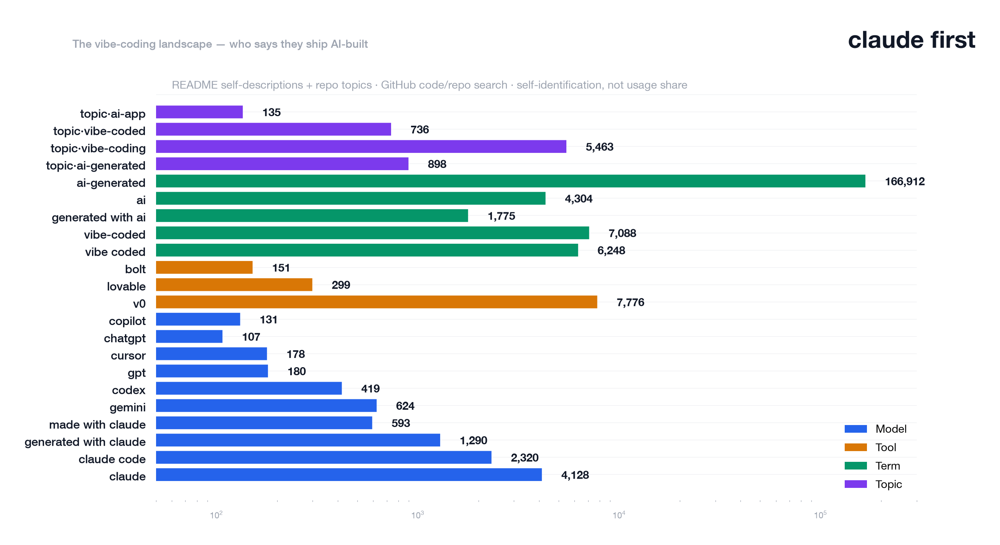
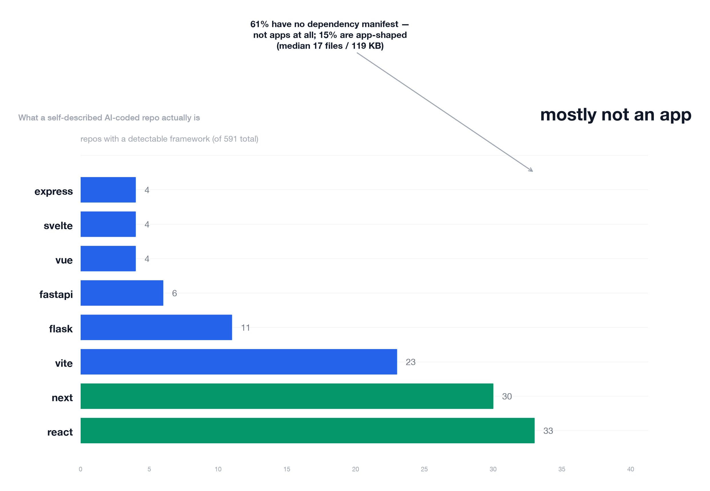

# Corpus Study — The vibe-coding landscape

**Status: census snapshot — August 2026.** GitHub README self-descriptions
and repo topics for the vibe-coding ecosystem, plus a composition
taxonomy of the 591-repo AI-coded corpus. The companion piece to the
three population studies: who says they ship AI-built, and with what.

**Honesty, stated up front:** these are **self-identification shares, not
usage shares**. Claude users advertise their tool choice in READMEs; GPT
and Copilot users mostly don't. The numbers are a snapshot of what repos
*claim*, and the claim itself is the signal.

## The market map



| Layer | Self-description | Repos |
|---|---|---|
| **Model** | "built with claude" | 4,128 |
| | "built with claude code" | 2,320 |
| | "generated with claude" | 1,290 |
| | "made with claude" | 593 |
| | "built with gemini" | 624 |
| | "built with codex" | 419 |
| | "built with gpt" | 180 |
| | "built with cursor" | 178 |
| | "built with chatgpt" | 107 |
| | "built with copilot" | 131 |
| **Tool** | "built with v0" | 7,776 |
| | "built with lovable" | 299 |
| | "built with bolt" | 151 |
| **Term** | "vibe-coded" | 7,088 |
| | "vibe coded" | 6,248 |
| | "built with ai" | 4,304 |
| | "generated with ai" | 1,775 |
| | "ai-generated" | 166,912 |
| **Topic** | `vibe-coding` | 5,463 |
| | `ai-generated` | 898 |
| | `vibe-coded` | 736 |
| | `ai-app` | 135 |

Three readings:

1. **Claude dominates model-level self-identification.** Every "built
   with" count across ChatGPT, GPT, Copilot, and Cursor combined (596) is
   less than a sixth of "built with claude" alone (4,128). Whether or
   not Claude is the most *used* model for vibe coding, it is the one
   people say they used. That asymmetry is itself the finding.
2. **The tool layer outnumbers the model layer.** "built with v0" (7,776)
   exceeds every model self-description — vibe coders name their
   generator more readily than their model. (7,088 "vibe-coded" and
   6,248 "vibe coded" bracket it: the term has settled.)
3. **"ai-generated" is a firehose, not a signal.** At 166,912 repos it
   describes asset pipelines and license notices more than apps — the
   reason the corpus program uses the narrower `ai-generated` *topic*
   (898, the complete enumerable surface) and README phrase checks.

## What a self-described AI-coded repo actually is



From the 591-repo AI-coded corpus (the `ai-generated` topic + "vibe-coded"
READMEs):

- **61% have no dependency manifest** — not apps at all. Tutorials,
  prompt collections, single-script repos, and personal configs dominate
  the self-described population.
- **15% are app-shaped** (manifest + framework + ≥ 30 files): 91 repos,
  median 107 files / 3.0 MB — comparable to the generator populations
  (Lovable 119 files / 1.6 MB, v0 79 files / 1.4 MB).
- **Framework mix** of the app-shaped slice: react 33, next 30, vite 23,
  flask 11, fastapi 6 — the same stack as the generator studies
  (frontend-first JS, Supabase-adjacent).

This is why the [AI-coded study](CORPUS_STUDY_AICODED.md) reports both the
unfiltered frame and the app-shaped slice: the unfiltered "92.9% clean"
was partly an artifact of including non-apps; the app-shaped slice
(71.4% clean, 7.7% commit .env) is the fair baseline.

## Method

- **Census:** GitHub code search for README self-descriptions
  (`"built with X" filename:README.md`) + repo search for topics; counts
  are `total_count`, sampled with created_at for growth context.
  Snapshot date in `market-map.json`.
- **Taxonomy:** the AI-coded corpus scan (`scan-results-app.jsonl`),
  which records per-repo app-shape (manifest presence, framework from
  package.json deps / requirements.txt, file counts).
- **Ethics:** counts and aggregates only — no repo-to-credential
  mapping; no secrets involved.

## Raw data

- `../data/corpus-aicoded/market-map.json` — census + taxonomy (published)
- `../data/corpus-aicoded/scan-results-app.jsonl` — per-repo app-shape rows (gitignored)
- Study pages: [Lovable](../report/index.html) · [v0](../report/v0/index.html) · [AI-coded](../report/aicoded/index.html) · [Four populations, one engine](../report/comparison/index.html)

## Reproduce

```bash
python backend/scripts/corpus/market_map.py \
    --results ../data/corpus-aicoded/scan-results-app.jsonl \
    --out ../data/corpus-aicoded/market-map.json
python backend/scripts/corpus/generate_report.py \
    --market ../data/corpus-aicoded/market-map.json
```
