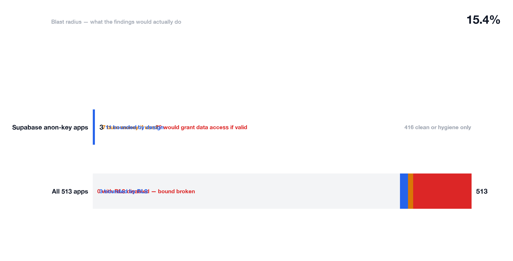
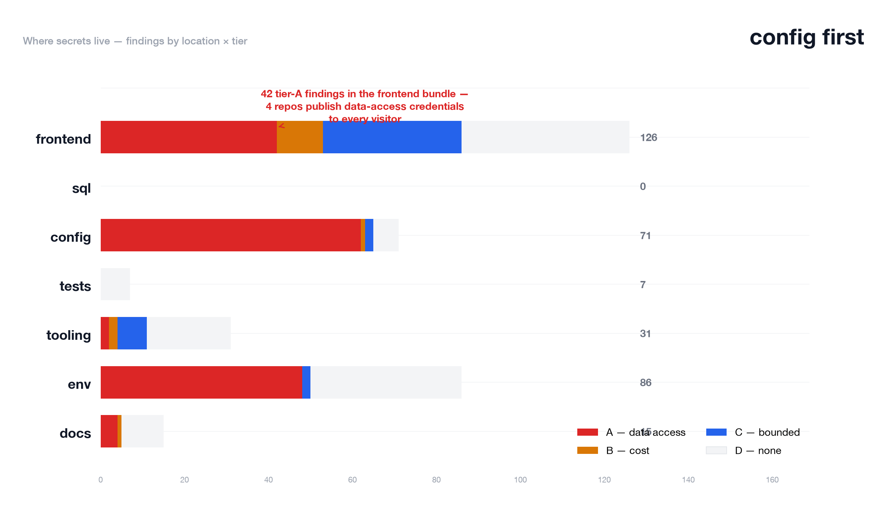

# Corpus Study — AI apps leak through code, not just .env

The v0.dev population (N = 513): where the hardcoded-key problem lives —
14.0% of v0-generated repos ship structurally verified data-access
credentials in config and frontend code, nearly double Lovable's 7.3%,
while committing .env at a quarter of Lovable's rate.

**Status: full run — N = 513 repos** (the complete enumerable surface:
671 code-search hits for `data-v0- language:HTML` merged with
`data-v0- extension:tsx`, deduplicated to 533; 513 downloaded and
scanned, 19 exceeded the 150 MB archive cap, 1 was gone).

The second population in Septr's corpus program, this time with a
different **axis and population** from ogbuilds' Lovable study: every
finding was adjudicated **exhaustively** (all 243 findings across all
95 non-clean repos, no subsampling), and the analysis is blast-radius
first — what the findings would *do*, not just how often they occur.

**Bolt is not studied:** the `__bolt__` marker lives in Bolt.new's
browser environment, not in committed repos. A code-search spike found
81 noisy hits (icon sets, data files, unrelated docs) and zero
`package.json` presence — no deterministic public signal exists.

## Method

- **Signal:** `data-v0-` attributes — v0.dev writes one into every
  generated component. Frame: `data-v0- language:HTML` (671 hits) merged
  with `data-v0- extension:tsx` (376), deduplicated to 533 public repos.
  99.8% platform-confirmed by the scan (512/513).
- **Scan:** the same Septr rules engine as the Lovable study, offline,
  over each repo's GitHub tarball (150 MB cap).
- **Verification:** **all 243 findings** in all 95 repos with
  non-existence findings were adjudicated one at a time with surrounding
  code — no subsampling. **55 dropped (22.6%), 188 kept.** Only
  high-confidence drops count.
- **Ethics:** same as the Lovable study — aggregates and anonymized rows
  only, no repo-to-credential mapping, no confirmed-live testing.

## Headline numbers (N = 513)

| Figure | v0 (Septr) | Lovable (Septr) | ogbuilds (n=1,969) |
|---|---|---|---|
| Committed `.env` | **7.0%** (CI 5.1–9.6) | 27.5% | 23.2% |
| No root `.gitignore` | **38.2%** (CI 34.1–42.5) | 10.4% | (reported) |
| Duplicated file family | **24.4%** (CI 20.9–28.3) | 8.9% | (reported) |
| `curl \| sh` pattern | 1.6% (CI 0.8–3.0) | 3.6% | (reported) |
| Fully clean | **64.7%** (CI 60.5–68.7) | 50.9% | 2.6% (their meter) |
| Median security score | 100 | 100 | 94 |
| **Mean security score** | **93.4** (q1 98 / q3 100) | 90.5 | — |
| A grade | **82.3%** | 84.0% | 64% |
| F grade | **4.7%** (24) | 7.3% (64) | 3% |

v0 apps are a different animal: **4× fewer committed .env files, 3.7× more
missing .gitignores, 2.7× more duplicated file families, and a lower F
rate.** v0's output skews to frontend-first projects: fewer backends, less
.env wiring, more template copies and hygiene misses.

## Blast radius: what the findings would actually do

| Tier | v0 repos | % (CI) | Lovable repos |
|---|---|---|---|
| **A — data access** | **79** | 15.4% (CI 12.5–18.8) | 88 |
| **B — cost** | 7 | 1.4% (CI 0.7–2.8) | 22 |
| **C — bounded** | 11 | 2.1% (CI 1.2–3.8) | 186 |
| **D — none** | 416 | 81.1% (CI 77.5–84.2) | 585 |



**The structurally verified tier-A subset is 72 repos (14.0%)** —
credential-bearing DB connection strings, live GitHub PATs, AWS keys —
**nearly double Lovable's 7.3% relative share** (14.0% vs 7.3%): v0 apps
commit more data-access credentials in code, but fewer through `.env`.

**The Supabase bound barely exists here** — 3 anon-key repos, 0
service-role, 0 RLS-disabled. v0 does not default to Supabase the way
Lovable does; the RLS story is a Lovable story.

## Where secrets live (file-location mechanics)



| Location | A — data | B — cost | C — bounded | D — none | Total |
|---|---|---|---|---|---|
| config (incl. MCP/JSON) | 62 | 1 | 2 | 6 | 71 |
| committed `.env` | 48 | 0 | 2 | 36 | 86 |
| frontend bundle | 42 | 11 | 33 | 40 | 126 |
| other (root files) | 26 | 16 | 1 | 75 | 118 |
| tooling (server/scripts) | 2 | 2 | 7 | 20 | 31 |
| docs | 4 | 1 | 0 | 10 | 15 |

**The leak mechanics are inverted from Lovable.** Lovable's tier-A
credentials live in docs (228 findings) and `.env` (181); v0's live in
**config (62) and the frontend bundle (42)** — and docs carry almost
nothing (4). v0 apps put secrets in JSON config, MCP manifests, and
client code where every visitor can read them:

- **GitHub PATs in frontend clone apps** — a full `ghp_` token in
  `src/core/api/get/*.tsx` (Github-Clone and its course-assignment copy)
  and in a sync component's settings tab: 8 findings, published to every
  visitor.
- **AWS keys in scraped job pages** — 29 AKIA access keys in presigned
  S3 URLs embedded in scraped HTML pages (third-party buckets inside the
  scraped content, not the repo owner's own keys — adjudicated as real
  credentials, kept).
- **DB connection strings in code and config** — 69 findings; the 6
  dropped were vendored pgx test fixtures, a tutorial `foobarbaz` secret,
  and docker-compose dev hosts. The kept ones are live MongoDB Atlas and
  Supabase Postgres URIs with real passwords.
- **Private keys in vendored Go testdata** — 20 findings, all 20 dropped:
  `pkg/mod/golang.org/x/crypto/.../testdata` fixtures are public test
  keys, not live credentials.

## Verification (243/243 findings, exhaustive — no subsample)

| Rule | Dropped | Total | Notes |
|---|---|---|---|
| `private_key` | 20 | 20 | Vendored Go testdata fixtures (x/crypto acme/ssh) |
| `resend_api_key` | 20 | 21 | **Pattern gap**: `re_` matched PIL internals, minified JS identifiers, image filenames. Resend keys never contain `_` — pattern tightened after this run (engine fix, validated by tests; rule-output figures here predate it) |
| `db_connection_string` | 6 | 69 | pgx test fixtures ×3, tutorial `foobarbaz`, docker-compose dev hosts ×2 |
| `generic_secret` | 5 | 29 | Jest fixtures (`access_token_123`), test ENCRYPTION_KEY |
| `google_api_key` | 2 | 38 | Firebase client configs — public by design |
| `openai_key` | 1 | 7 | `sk-proj-XXX…` docs placeholder |
| `github_token` | 1 | 15 | Form-input placeholder text |
| `supabase_anon` / `gemini` / `aws` / `rls` / `stripe` | 0 | 44 | Role-verified and live-format keys hold at 0 drops |

**Overall: 55/243 dropped (22.6%)** — comparable to ogbuilds' 19.8%
pattern-rule ceiling, but here the drops are concentrated in two
mechanically explainable classes (private-key testdata, resend lookalikes).
The **AWS keys kept at 0/32 drops** — the presigned-URL catch is real at
scale.

## Engine fixes from this run

1. **`resend_api_key` pattern tightened** — `\bre_[A-Za-z0-9_-]{20,}`
   matched PIL internals (`re_xref_subsection_start`), minified JS
   identifiers (`re_parseAttr_*`) and image filenames. Resend keys are
   `re_` + ~20 alphanumerics with no underscores; pattern is now
   `\bre_[A-Za-z0-9]{20,}` with regression tests.
2. **Vendored testdata lesson** — Go module testdata fixtures are the
   single biggest private-key FP source; the corpus walk now prunes the
   `pkg/mod` module-cache layout (path-aware `prune_vendored` — name-based
   skip sets can't express it), and the CLI audit's recursive scan does
   the same. The betterleaks benchmark on the same archives confirmed the
   class at scale (their scanner still flags it: 55 private-key findings
   in the vendored-Go repo).
3. **JSON-escaped PEM evasion** — service-account JSON stores private keys
   as literal `\n` text, which evaded the `private_key` pattern (its body
   charset has real whitespace but no backslash). New `gcp_service_account`
   check (critical) detects the service-account shape, and `private_key`
   now matches escaped PEM — verified on the frame: WAGAZ (Lovable) and
   laginow (v0) committed real GCP keys that previously went undetected.

## Raw data (this directory)

- `frame.json` — the 533-repo frame (queries, timestamps)
- `archives/` — 513 downloaded tarballs (gitignored)
- `scan-results.jsonl` — per-repo rows (existence flags + findings, redacted previews)
- `verify-task.jsonl` — the 243 adjudication tasks with redacted context
- `verdicts.jsonl` — verdicts, confidence, reasons
- `aggregates.json`, `blast-radius.json`, `secret-locations.json` — machine-readable results
- `scan-results.anonymized.jsonl`, `verdicts.anonymized.jsonl` — published rows

## How to reproduce

```bash
GITHUB_TOKEN=... python backend/scripts/corpus/build_frame.py --platform v0 \
    --out ../data/corpus-v0/frame.json
python backend/scripts/corpus/download_corpus.py --frame ../data/corpus-v0/frame.json \
    --out ../data/corpus-v0 --workers 8
python backend/scripts/corpus/scan_corpus.py --dir ../data/corpus-v0 --platform v0 --workers 4
python backend/scripts/corpus/verify_corpus.py --dir ../data/corpus-v0 --repos 100 --seed 20260812
python backend/scripts/corpus/aggregate_corpus.py --dir ../data/corpus-v0 --platform v0
python backend/scripts/corpus/blast_radius.py --dir ../data/corpus-v0
python backend/scripts/corpus/secret_locations.py --dir ../data/corpus-v0
python backend/scripts/corpus/anonymize_corpus.py --dir ../data/corpus-v0
```

## Known limitations

- The frame is the complete `data-v0-` enumerable surface, but v0 apps
  whose components are built to plain JS (no HTML/TSX attribute visible
  to code search) are missed; forks and template copies are not excluded.
- The resend pattern was tightened after this run; `resend_api_key`
  rule-output figures here (21 findings) predate the fix and over-count
  by roughly 20 lookalikes. The exhaustive adjudication already corrects
  the adjusted numbers (20/21 dropped).
- Verification is single-model, high-confidence-drops-only.
