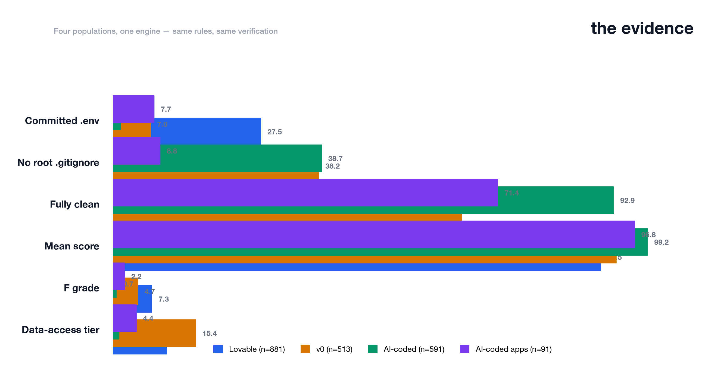

# Septr Research — the evidence

Septr's corpus program: **2,076 apps across four populations, 649
adjudicated findings, one rules engine.** Every proportion carries a 95%
Wilson confidence interval; every finding was verified by hand
(role-verified JWTs: 0/269 false positives). No secrets published, no
keys tested.

**Plus the live deployment study: 1,248 public deployments probed
(1,267 scan runs), 11 critical API keys found in client-side
bundles** — [write-up](LIVE_SCAN_STUDY.md).

## The reports

| # | Report | Population | The angle | Read |
|---|---|---|---|---|
| 1 | **1 in 4 AI-built apps ships its .env file** | Lovable, N=881 | The durable presence figure — env-centric leak mechanics | [visual](../report/index.html) · [write-up](CORPUS_STUDY.md) |
| 2 | **AI apps leak through code, not just .env** | v0, N=513 | The inverted mechanics — config + frontend bundles | [visual](../report/v0/index.html) · [write-up](CORPUS_STUDY_V0.md) |
| 3 | **AI coding isn't the problem — the generators are** | AI-coded, N=591 (+91 app-shaped) | Exposure tracks wiring, not AI | [visual](../report/aicoded/index.html) · [write-up](CORPUS_STUDY_AICODED.md) |
| 5 | **Do AI-built apps ship weaponizable dependencies?** | deps, N=1,375 | v0 ships vulnerable deps at 89.6% — half with public exploits | [write-up](CORPUS_STUDY_DEPS.md) |
| 4 | **The vibe-coding landscape** | census | Who says they ship AI-built, and with what | [visual](../report/landscape/index.html) · [write-up](CORPUS_STUDY_LANDSCAPE.md) |
| — | **Four populations, one engine** | case study | The whole program in one chart | [visual](../report/comparison/index.html) |
| 6 | **11 critical API keys found in deployed apps** | live URLs, N=1,248 (1,258 runs) | Real-world blast radius: service_role + OpenAI keys in client bundles | [write-up](LIVE_SCAN_STUDY.md) |

## The headline numbers

| | Lovable (881) | v0 (513) | AI-coded (591) | AI-coded apps (91) |
|---|---|---|---|---|
| Committed .env | 27.5% | 7.0% | 1.5% | 7.7% |
| Fully clean | 50.9% | 64.7% | 92.9% | 71.4% |
| Mean score | 90.5 | 93.4 | 99.2 | 96.8 |
| F grade | 7.3% | 4.7% | 0.7% | 2.2% |

**The finding:** exposure is a property of generator workflows, not of
AI coding. Lovable builds env-wired apps and 27.5% commit their .env;
v0 builds code-heavy frontends and 15.4% ship data-access credentials in
config/bundles; self-described AI-coded apps leak at 1.5–7.7%. Septr is
built for exactly this environment — the studies are the evidence.

## Method (same across all studies)

- **Frame:** deterministic GitHub search signals, complete enumerable
  surfaces where they exist (Lovable: `lovable-tagger`, 900-repo frame;
  v0: `data-v0-`, 671 hits; AI-coded: `ai-generated` topic, 898 repos).
  Seeded, reproducible ordering.
- **Scan:** Septr's rules engine, offline, over GitHub tarballs.
  Existence checks + bundle checks + duplication, content-derived
  severity for committed .env files.
- **Verification:** every finding in the sample adjudicated with
  surrounding code under the only-high-confidence-drops-count rule —
  649 findings total (361 + 243 + 45). Supabase roles verified from the
  JWT payload: 0/269 false positives.
- **Analysis:** blast radius (what a leaked credential would actually
  grant) and location mechanics (where secrets live) on every population.
- **Ethics:** aggregates and anonymized rows only; no repo-to-credential
  mapping; no confirmed-live credential testing.

## Raw data

Per-study published artifacts (aggregates, blast-radius, market map,
anonymized scan rows + verdicts): `../data/corpus*/`.

Live deployment study (anonymized scan rows, aggregates,
critical-findings digest, platform breakdown, hosting breakdown):
`../data/live-scan/`. The exposure splits cleanly by deployment model:
platform-managed hosts (`*.lovable.app`, `*.replit.app`) contributed
zero critical/high findings, while self-deployed exports to
Vercel/Netlify/Pages accounted for all 11.

## Compare

Inspired by ogbuilds' [What 1,969 Lovable apps actually ship](https://ogbuilds.ai/studies/lovable-app-security)
and their 549-repo AI-coded study. Where we differ: their headline
figures are rule output before verification (42.2% credential upper
bound, 20.4% exposed-secret, 2.6% clean); ours are verified — the
difference is precision, and the drop rates are published raw.
